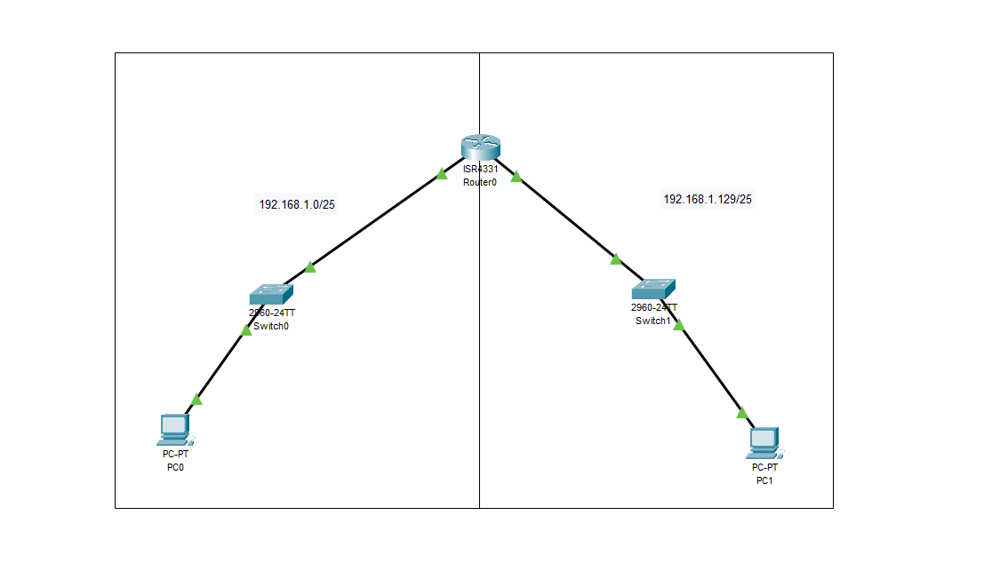

# Understanding CIDR (Classless Inter-Domain Routing)

CIDR is a method for allocating IP addresses and routing Internet Protocol packets. It is used to create unique identifiers for networks and individual devices. This method allows for a more flexible allocation of IP addresses compared to the traditional classful network design.



In this documentation, we will explore how CIDR works and its significance in network design. We have utilized Cisco Packet Tracer, a powerful network simulation program, to demonstrate the principles of CIDR. This tool enables us to visualize how data packets are routed in a network that employs CIDR for IP addressing.

## Key Concepts of CIDR

- **IP Addressing:** CIDR uses a notation known as CIDR notation, which is a compact representation of an IP address and its associated routing prefix.
- **Subnetting:** CIDR allows for efficient subnetting, enabling networks to be divided into subnetworks of various sizes. This is crucial for optimizing network performance and resource utilization.
- **Supernetting:** CIDR also supports supernetting, the aggregation of multiple contiguous subnets into a larger network. This reduces the complexity of routing tables in the Internet.

## Simulation with Packet Tracer

In our Packet Tracer simulation, we have set up a network that demonstrates the use of CIDR in creating efficient and scalable network designs. The simulation includes several subnets, each configured with a unique CIDR block, showcasing how CIDR facilitates easy management and routing of IP addresses.

### Benefits of Using Packet Tracer for CIDR Simulation

- **Visual Learning:** Packet Tracer provides a visual representation of network topology, making it easier to understand the flow of data packets.
- **Hands-on Experience:** It offers a hands-on approach to learning about networking concepts, including CIDR, without the need for physical hardware.
- **Experimentation:** Users can experiment with different network configurations and scenarios to see the effects of CIDR on network efficiency and performance.

## Codes Used in Router Configuration for CIDR

To configure the routers in our Packet Tracer simulation for CIDR, the following commands were used:

```plaintext
# Configure Both Interface to Power On
Router(config)#int range gig0/0/0-1
Router(config-if-range)#no shutdown

# Configure the first interface
Router(config-if)#int gig0/0/0
Router(config-if)#ip address 192.168.1.1 255.255.255.128


# Configure the second interface
Router(config-if)#int gig0/0/1
Router(config-if)#ip address 192.168.1.130 255.255.255.128